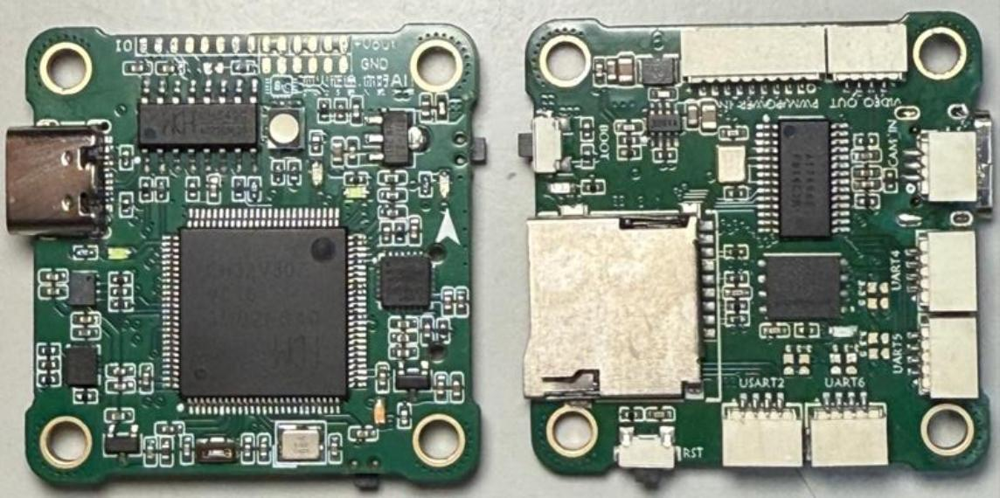

# 基于 CH32V307 的多旋翼飞控系统

## 项目背景

这是一块面向多旋翼无人机和小型机器人飞行平台的自研飞控板。它不是单纯为了“把器件堆到一块 PCB 上”，而是希望把飞控开发中最常见、最折腾人的几件事放到一块可复用的硬件底板上：稳定供电、可靠的惯性测量、足够多的外设接口、飞行参数调试、数据记录，以及后续算法迭代需要的扩展空间。

项目以沁恒 CH32V307VCT6 作为主控，配合 CH549G、ICM42688、MPU6050、DPS310、AT7456E、W28Q128 等芯片，面向 4-6S 电池供电场景设计。它更像是一块“能上机飞、也能继续折腾”的飞控实验平台：既可以用于多旋翼整机验证，也可以作为姿态解算、PID 控制、传感器融合、数据记录和上位机调参的课程设计或开源硬件基础。

对本科项目来说，这个项目的价值不只在于画完一块板，而在于它覆盖了完整的工程闭环：从电源和接口规划，到 PCB 设计、样板验证、参数调试，再到连续飞行测试。README 里会尽量把这些信息写清楚，方便后来者判断这个项目能做什么、怎么打开、从哪里开始复现。

当前目录包含立创 EDA 专业版硬件工程文件：

- ProPrj_v307飞控_2026-08-23.epro2

## 设计目标

本项目的设计目标可以概括为“稳定、好调、能扩展”。飞控板一旦装到机架上，任何小问题都会被放大：供电不稳会造成传感器异常，接口不够会限制后续外设，参数不能方便修改会让调机过程非常低效。因此这个项目在硬件规划时重点考虑了以下几件事：

- 适配 4-6S 动力电池，覆盖常见多旋翼供电范围。
- 提供 5V 与 3.3V 输出切换能力，减少外设供电适配成本。
- 引出多路串口、IO、ADC、PWM，方便接入接收机、电调、GPS、数传、传感器和调试设备。
- 支持 TF 卡，用于记录飞行日志、保存参数或载入配置。
- 支持上位机调参，让 PID、传感器校准和飞行状态观察不必完全依赖重新编译固件。
- 预留足够调试空间，便于后续继续改固件、做算法、换传感器或扩展外设。

## 功能特性

- 支持 4-6S 宽电压输入，适合常见穿越机、航模和小型多旋翼平台。
- 支持 5V / 3.3V 输出任意切换，可按外设需求选择供电逻辑。
- 主控采用 CH32V307VCT6，具备较丰富的外设资源，适合飞控主循环、通信和控制输出。
- 板载 CH549G，可辅助完成 USB、接口扩展或相关外设管理。
- 板载 ICM42688 与 MPU6050，可用于惯性测量、姿态估计和冗余验证。
- 板载 DPS310，可用于气压高度相关数据采集。
- 板载 AT7456E，为视频叠加显示等飞行信息显示功能留下硬件基础。
- 板载 W28Q128，可用于参数、日志或配置数据存储扩展。
- 引出 4 路串口，以及 10 余路 IO / ADC / PWM，便于连接飞控常用外设。
- 支持 TF 卡插入，可用于飞行数据记录或参数载入。
- 支持自研上位机调参，适合反复调试 PID、观察状态量和记录问题。
- 预设三套 PID 参数，可根据不同尺寸机架进行快速适配。
- 已完成连续飞行 600s 无故障测试，说明硬件链路和基础运行稳定性已经经过实际验证。

## 硬件构成

飞控系统由主控、传感器、电源、接口、存储和调试几部分组成。主控部分负责飞控主循环、姿态解算、控制输出和通信调度；传感器部分负责采集角速度、加速度、气压等飞行状态数据；接口部分用于连接电调、接收机、调试串口、外部模块和上位机；存储部分用于参数与日志；电源部分则负责从动力电池输入中转换出飞控和外设需要的稳定电压。

其中，SY8303 负责降压至 5V，CAJ1117B 负责降压至 3.3V。飞控板的设计并不追求“只为某一台飞机服务”，而是尽量做成一个可以迁移的硬件平台：换一个机架、换一组电调或换一种外设时，不需要从零开始重新画板。

## 安装与打开工程

1. 安装立创 EDA 专业版。
2. 克隆或下载本项目仓库。
3. 使用立创 EDA 专业版打开 ProPrj_v307飞控_2026-08-23.epro2。
4. 检查原理图、PCB、BOM 与封装映射是否完整。
5. 根据实际加工需求导出 Gerber、BOM、贴片坐标文件或生产资料。
6. 若需要进行固件开发，可准备沁恒 RISC-V MCU 开发环境、WCH-Link 调试器及对应烧录工具。
7. 首次装配后建议先不接动力系统，只验证 5V、3.3V、传感器供电和调试接口，再逐步接入外设。

## 使用示例

一个比较稳妥的复现流程如下：先打开硬件工程，确认供电、电源切换、IMU、气压计、TF 卡、串口和 PWM 输出等核心部分；然后按照 BOM 进行打样和焊接；上电时先使用限流电源检查各路电压，确认没有短路或异常发热；再通过调试接口连接上位机，读取传感器数据，完成陀螺仪、加速度计和气压相关校准。

进入整机调试时，可以先在桌面环境中接入接收机和电调，验证电机输出顺序、通道映射和安全解锁逻辑。之后再装机进行低油门测试，并选择三套预设 PID 中更接近当前机架的一组作为起点。完成基础悬停后，再通过上位机逐步调整控制参数，并使用 TF 卡记录飞行日志。这样每一次飞行都能留下可回看的数据，不会只凭感觉调机。

## 技术架构

- 主控层：CH32V307VCT6 负责姿态解算、控制输出、通信调度和外设管理。
- 协处理与接口层：CH549G 与多路串口、IO、ADC、PWM 接口提供外设扩展能力。
- 传感器层：ICM42688、MPU6050、DPS310 等器件用于惯性测量和气压高度相关数据采集。
- 存储与显示层：TF 卡、W28Q128 与 AT7456E 支持数据记录、参数载入和视频叠加显示相关扩展。
- 电源层：SY8303 降压至 5V，CAJ1117B 降压至 3.3V，并支持 5V / 3.3V 输出切换。
- 调试层：上位机与串口链路用于参数配置、状态查看和飞控调参。
- 应用层：面向多旋翼飞行、姿态控制算法验证、飞行日志采集和开源硬件教学复现。

## 测试记录

根据当前项目资料，飞控板已经完成 4-6S 宽电压输入验证，并完成连续飞行 600s 无故障测试。这个结果说明项目不是停留在纸面原理图阶段，而是已经走到了实机运行和稳定性验证阶段。后续如果继续完善开源材料，建议补充测试照片、飞行视频、日志截图、上位机界面截图和不同机架 PID 参数记录，这些材料会让项目主页更有说服力。

## 项目照片

本仓库已补充 `photo/` 目录，用于展示多旋翼飞控系统装置实物。完整照片说明见 `docs/PHOTOS.md`。

## 开源说明

本仓库开放多旋翼飞控硬件工程、项目文档和实物照片，方便其他人查看供电、传感器、接口、日志记录和调参链路。后续建议继续补充飞行测试视频、上位机调参截图、飞行日志样例、通信协议说明和固件编译烧录流程。

## 后续计划

- 补充原理图关键模块说明图，降低后来者阅读硬件工程的门槛。
- 补充固件仓库或固件目录，说明编译、烧录和调参流程。
- 补充上位机截图和通信协议说明。
- 补充飞行日志样例，用真实数据展示姿态、油门、电压和控制输出变化。
- 增加常见问题记录，例如无法识别传感器、串口无输出、电机顺序错误、PID 震荡等排查方法。

## Source Code

本仓库已补充源码压缩包 `code/ch32v307-multirotor-flight-controller-source-code.zip`，包含 CH32 多旋翼飞控相关固件源码。源码归档说明、SHA256 校验值和打包边界见 `docs/SOURCE_CODE.md`。

## License

This hardware design is released under CERN Open Hardware Licence Version 2 - Permissive (CERN-OHL-P-2.0). See LICENSE. If firmware is added later, place a separate software license in the firmware directory.
